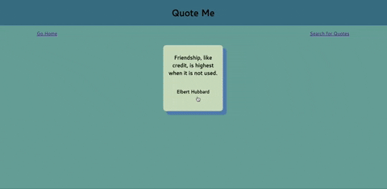

### Project Overview
The Quote Me application was created for those who like to see random quotes, search for quotes by particular people, and read a breif bio of those people. 

### Context
I developed this project as my final showcase project at the end of Module 3 at the Turing School for Software Development and Design after 34 weeks as a front-end developer. The project took at approximately six days to completely from planning to documentation while balancing a full courseload.

[Deployed Site](https://weary-liquid.surge.sh/)

### Built With:

### Setup
In your terminal:

* Clone down this directory: `git clone https://github.com/arstaffieri/quote-me`.

* Cd into this directory: `cd quote-me`.

* Install dependencies for this repo: `npm install`.

* Run `npm start` to start application in your browser.

### Learning Goals
#### Demonstrate proficiency of the following:

* React
* Router
* Asynchronous JavaScript
* End-to-end testing with Cypress

### Reflections
This was my first solo project using React and Cypress. I learned a great deal during the project. If I had it to do over again, I would have used hooks rather than class based components. I might also have built my own backend to enable users to add quotes as well. 

Contact

Angie Staffieri

[GitHub](https://github.com/arstaffieri)
[LinkedIn](https://www.linkedin.com/in/angie-staffieri/0)
